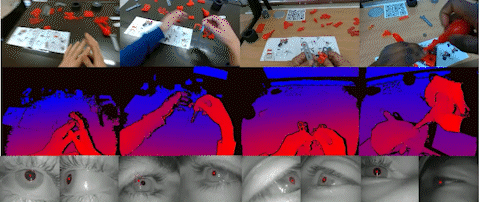

# The MECCANO Dataset

This is the official github repository related to the MECCANO Dataset.

 <h2><a href="https://github.com/fpv-iplab/MECCANO/blob/master/Challenge.md">Running ICIAP Competition with Prize!</a></h2>

<div align="center">
  
</div>

MECCANO is a multimodal dataset of egocentric videos to study humans behavior understanding in industrial-like settings. The multimodality is characterized by the presence of gaze signals, depth maps and RGB videos acquired simultaneously with a custom headset. You can download the MECCANO dataset and its annotations from the [project web page](https://iplab.dmi.unict.it/MECCANO/).

## Use the MECCANO Dataset with PySlowFast
To use the MECCANO Dataset in PySlowfast please follow the instructions below:

* Install PySlowFast following the [official instructions](https://github.com/facebookresearch/SlowFast/blob/master/INSTALL.md);
* Download the PySlowFast_files folder from this repository;
* Place the files "__init__.py", "meccano.py" and "sampling.py" in your slowfast/datasets/ folder;
* Place the files "__init__.py", "custom_video_model_builder_MECCANO_gaze.py" in your slowfast/models/ folder (to use the gaze signal).

Now, run the training/test with:
```
python tools/run_net.py --cfg path_to_your_config_file --[optional flags]
```
### Pre-Extracted Features
We provide pre-extracted features of MECCANO Dataset:

* RGB features extracted with SlowFast: [`coming soon`]


## Use the MECCANO Dataset with Detectron2
To use the MECCANO Dataset in Detectron2 to perform Object Detection and Recognition please follow the instructions below:

* Install Detectron2:
    ```
    pip install -U torch torchvision cython
    pip install -U 'git+https://github.com/facebookresearch/fvcore.git' 'git+https://github.com/cocodataset/cocoapi.git#subdirectory=PythonAPI'
    git clone https://github.com/facebookresearch/detectron2 detectron2_repo
    pip install -e detectron2_repo
    # You can find more details at https://github.com/facebookresearch/detectron2/blob/master/INSTALL.md
    ```
* Register the MECCANO Dataset adding the following instructions in detectron2_repo/tools/run_net.py, in the main() function:
    ```
    register_coco_instances("Meccano_objects_train", {}, "/path_to_your_folder/instances_meccano_train.json", "/path_to_the_MECCANO_active_object_annotations_frames/")
    register_coco_instances("Meccano_objects_val", {}, "/path_to_your_folder/instances_meccano_val.json", "/path_to_the_MECCANO_active_object_annotations_frames/")
    register_coco_instances("Meccano_objects_test", {}, "/path_to_your_folder/instances_meccano_test.json","/path_to_the_MECCANO_active_object_annotations_frames/")
    ```

Now, run the training/test with:
```
python tools/train_net.py --config-file path_to_your_config_file --[optional flags]
```

## Use the MECCANO Dataset with RULSTM
To use the MECCANO Dataset with RULSTM please follow the instructions below:

* Download source code of RULSTM following the [official instructions](https://github.com/fpv-iplab/rulstm);
* Download the RULSTM_files folder from this repository;
* Place the files "meccano_dataset.py" and "main.py" in your RULSTM main folder;
* Download the .csv files with the action annotation of MECCANO dataset from [here](https://iplab.dmi.unict.it/sharing/MECCANO/MECCANO_action_annotations.zip);
* Download the Pre-Extracted features of MECCANO dataset from [here](https://iplab.dmi.unict.it/sharing/MECCANO/RULSTM_MECCANO_features.zip).

Now, run the test with:
```
python main.py test ../../test_features/ models/meccano/final_fusion_model.pt --modality fusion --task anticipation --num_class 61 --img_tmpl {:05d}.jpg --meccanomulti
```

## Model Zoo and Baselines

### 1) Action Recognition

#### PySlowFast models

We provided pretrained models on the MECCANO Dataset for the action recognition task (only for the first version of the dataset):
| architecture | depth |  model  | config |
| ------------- | -------------| ------------- | ------------- |
| I3D | R50 | [`link`](https://iplab.dmi.unict.it/sharing/MECCANO/models/action_recognition/first_version/I3D_8x8_R50_MECCANO.pyth) | configs/action_recognition/I3D_8x8_R50.yaml |
| SlowFast | R50 | [`link`](https://iplab.dmi.unict.it/sharing/MECCANO/models/action_recognition/first_version/SLOWFAST_8x8_R50_MECCANO.pyth) | configs/action_recognition/SLOWFAST_8x8_R50.yaml |

We provided pretrained models on the MECCANO Multimodal Dataset for the action recognition task:
| architecture | depth | modality | model  | config |
| ------------- | ------------- | -------------| ------------- | ------------- |
| SlowFast | R50 | RGB | [`link`](https://iplab.dmi.unict.it/sharing/MECCANO/models/action_recognition/SLOWFAST_8x8_R50_RGB_MECCANO.pyth) | configs/action_recognition/SLOWFAST_8x8_R50_MECCANO.yaml |
| SlowFast | R50 | Depth | [`link`](https://iplab.dmi.unict.it/sharing/MECCANO/models/action_recognition/SLOWFAST_8x8_R50_Depth_MECCANO.pyth) | configs/action_recognition/SLOWFAST_8x8_R50_MECCANO.yaml |

### 2) Active Object Detection and Recognition
#### Detectron2 models

We provided pretrained models on the MECCANO Dataset for the active object recognition task:
| architecture | depth |  model  | config |
| ------------- | -------------| ------------- | ------------- |
| Faster RCNN | R101_FPN | [`link`](https://iplab.dmi.unict.it/sharing/MECCANO/models/active_object_recognition/MECCANO_active_objects.pth) | configs/active_object_recognition/meccano_active_objects.yaml |

### 3) Egocentric Human-Object Interaction (EHOI) Detection

For the active objects detection involved in the interaction, you have to use the model provided for the 2) task.

#### PySlowFast models (verb prediction)

We provided pretrained models on the MECCANO Multimodal Dataset for the verb prediction of the EHOI detection task:
| architecture | depth | modality | model  | config |
| ------------- | ------------- | -------------| ------------- | ------------- |
| SlowFast | R50 | RGB | [`link`](https://iplab.dmi.unict.it/sharing/MECCANO/models/ehoi_detection/SLOWFAST_8x8_R50_RGB_MECCANO_verbs.pyth) | configs/ehoi_detection/SLOWFAST_8x8_R50_MECCANO_ehoi.yaml |
| SlowFast | R50 | Depth | [`link`](https://iplab.dmi.unict.it/sharing/MECCANO/models/ehoi_detection/SLOWFAST_8x8_R50_Depth_MECCANO_verbs.pyth) | configs/ehoi_detection/SLOWFAST_8x8_R50_MECCANO_ehoi.yaml |


### 4) Action Anticipation

#### RULSTM models

We provided the best model trained on MECCANO Multimodal Dataset which uses three branches: Objects, Gaze and Hands.
| architecture | modality | model |
| ------------- | ------------- | -------------| 
| RULSTM | Obj, Gaze, Hands | [`link`](https://iplab.dmi.unict.it/sharing/MECCANO/models/action_anticipation/MECCANO_RULSTM-anticipation_0.25_6_8_fusion_mt5r_best.pth.tar)|

### 5) Next-Active Objects (NAOs) Prediction
#### Detectron2 models

We provided pretrained models on the MECCANO Dataset for the next-active object prediction task:
| architecture | depth | train_data| model  | config |
| ------------- | -------------| ------------- |------------- | ------------- |
| Faster RCNN | R101_FPN | active+next-active | [`link`](https://iplab.dmi.unict.it/sharing/MECCANO/models/next_active_object/MECCANO_next_active_objects.pth) | configs/next-active_object/meccano_next_active_objects.yaml |

## Citing the MECCANO Dataset
If you find the MECCANO Dataset useful in your research, please use the following BibTeX entry for citation.
```BibTeX
@misc{ragusa2022meccano,
title={MECCANO: A Multimodal Egocentric Dataset for Humans Behavior Understanding in the Industrial-like Domain},
author={Francesco Ragusa and Antonino Furnari and Giovanni Maria Farinella},
year={2022},
eprint={2209.08691},
archivePrefix={arXiv},
primaryClass={cs.CV}
}
```
Additionally, cite the original paper:
```BibTeX
@inproceedings{ragusa2021meccano,
  title = {The MECCANO Dataset: Understanding Human-Object Interactions from Egocentric Videos in an Industrial-like Domain},
  author = {Francesco Ragusa and Antonino Furnari and Salvatore Livatino and Giovanni Maria Farinella},
  year = {2021},
  eprint = {2010.05654},
  booktitle = {IEEE Winter Conference on Application of Computer Vision (WACV)}
}
```
